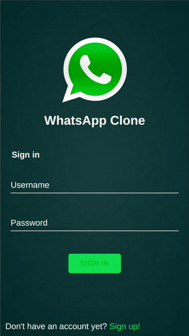

# SmartChat-Server



### Prerequisites

- Git clone
  ```
    git clone https://github.com/vbosstech/WhatsApp-Chat-Server
  ```
- Install [PostgreSQL Docker Desktop for Mac or Windows](https://www.docker.com/products/docker-desktop): https://hub.docker.com/editions/community/docker-ce-desktop-mac

  ```
    cd WhatsApp-Chat-Server
    docker-compose up -d
  ```    

- Create PostgreSQL Database, User & Password

  ```
    ## 1st-time ONLY
    # brew install psqlodbc
    psql -h localhost -U postgres
  ```

### Deployment

- Run yarn: $ `yarn install`
- Run codegen to generate TypeScript types: $ `yarn generate`
- Run start $ `yarn start`

Note that the server is using a common Cloudinary storage for uploading images. To change Cloudinary URL, please edit the `.env` file.